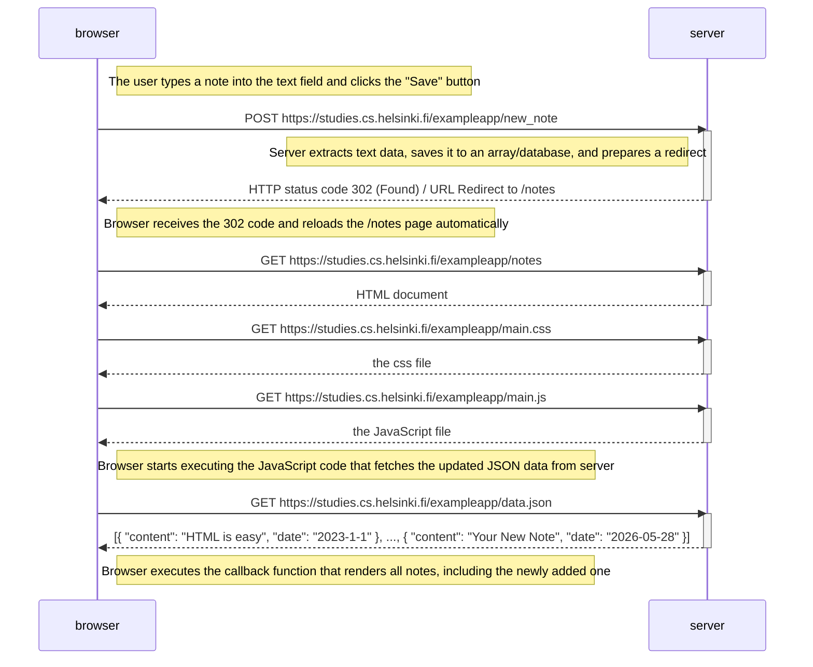

```mermaid
sequenceDiagram
    participant browser
    participant server

    Note right of browser: The user types a note into the text field and clicks the "Save" button

    browser->>server: POST https://studies.cs.helsinki.fi/exampleapp/new_note
    activate server
    Note left of server: Server extracts text data, saves it to an array/database, and prepares a redirect
    server-->>browser: HTTP status code 302 (Found) / URL Redirect to /notes
    deactivate server

    Note right of browser: Browser receives the 302 code and reloads the /notes page automatically

    browser->>server: GET https://studies.cs.helsinki.fi/exampleapp/notes
    activate server
    server-->>browser: HTML document
    deactivate server

    browser->>server: GET https://studies.cs.helsinki.fi/exampleapp/main.css
    activate server
    server-->>browser: the css file
    deactivate server

    browser->>server: GET https://studies.cs.helsinki.fi/exampleapp/main.js
    activate server
    server-->>browser: the JavaScript file
    deactivate server

    Note right of browser: Browser starts executing the JavaScript code that fetches the updated JSON data from server

    browser->>server: GET https://studies.cs.helsinki.fi/exampleapp/data.json
    activate server
    server-->>browser: [{ "content": "HTML is easy", "date": "2023-1-1" }, ..., { "content": "Your New Note", "date": "2026-05-28" }]
    deactivate server

    Note right of browser: Browser executes the callback function that renders all notes, including the newly added one
```