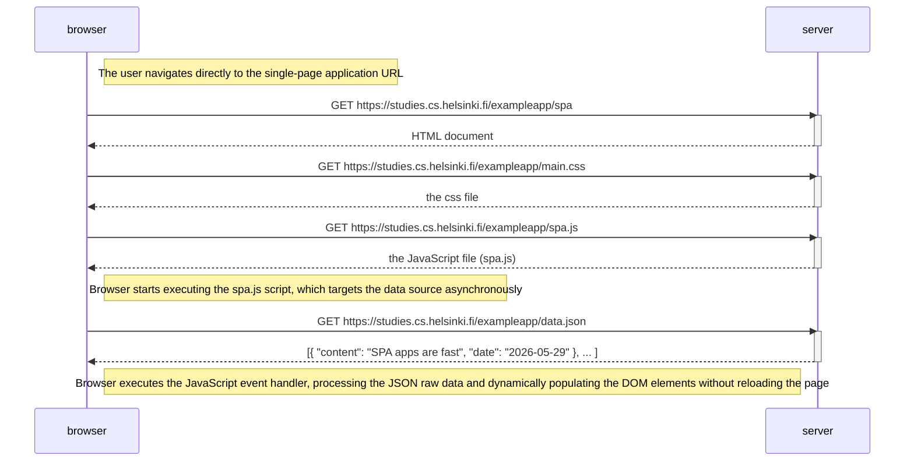

```mermaid
sequenceDiagram
    participant browser
    participant server

    Note right of browser: The user navigates directly to the single-page application URL

    browser->>server: GET https://studies.cs.helsinki.fi/exampleapp/spa
    activate server
    server-->>browser: HTML document
    deactivate server

    browser->>server: GET https://studies.cs.helsinki.fi/exampleapp/main.css
    activate server
    server-->>browser: the css file
    deactivate server

    browser->>server: GET https://studies.cs.helsinki.fi/exampleapp/spa.js
    activate server
    server-->>browser: the JavaScript file (spa.js)
    deactivate server

    Note right of browser: Browser starts executing the spa.js script, which targets the data source asynchronously

    browser->>server: GET https://studies.cs.helsinki.fi/exampleapp/data.json
    activate server
    server-->>browser: [{ "content": "SPA apps are fast", "date": "2026-05-29" }, ... ]
    deactivate server

    Note right of browser: Browser executes the JavaScript event handler, processing the JSON raw data and dynamically populating the DOM elements without reloading the page
```