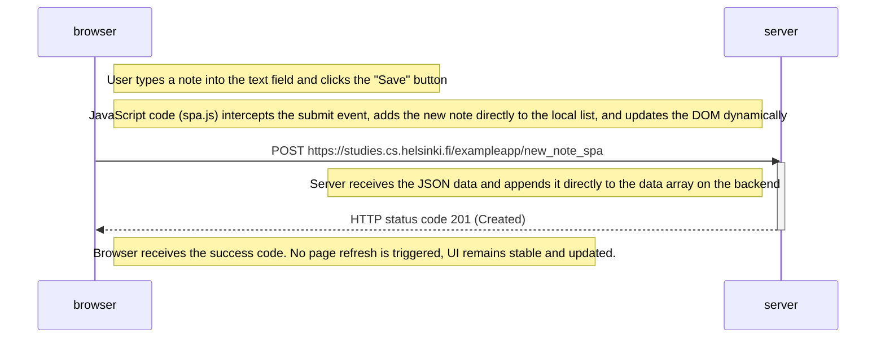

```mermaid
sequenceDiagram
    participant browser
    participant server

    Note right of browser: User types a note into the text field and clicks the "Save" button

    Note right of browser: JavaScript code (spa.js) intercepts the submit event, adds the new note directly to the local list, and updates the DOM dynamically

    browser->>server: POST https://studies.cs.helsinki.fi/exampleapp/new_note_spa
    activate server
    Note left of server: Server receives the JSON data and appends it directly to the data array on the backend
    server-->>browser: HTTP status code 201 (Created)
    deactivate server

    Note right of browser: Browser receives the success code. No page refresh is triggered, UI remains stable and updated.
```